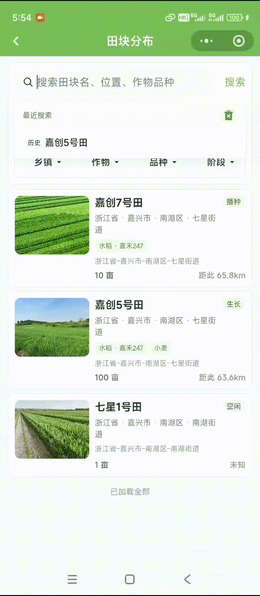
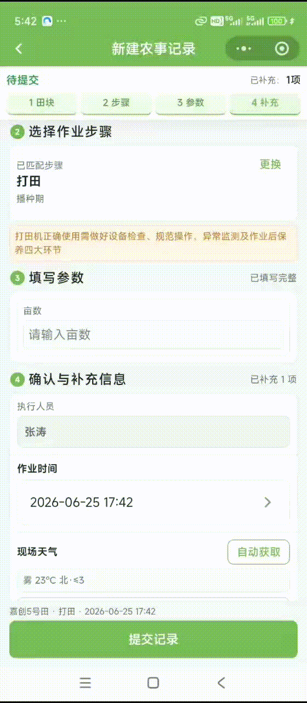
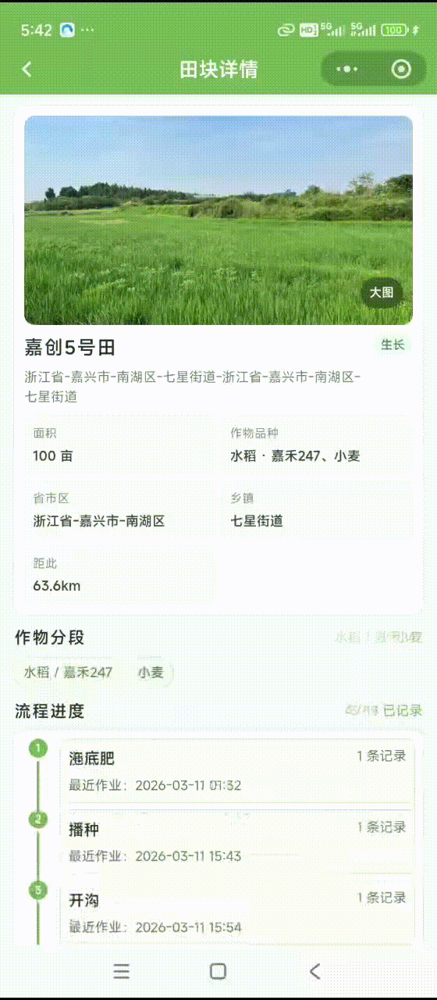
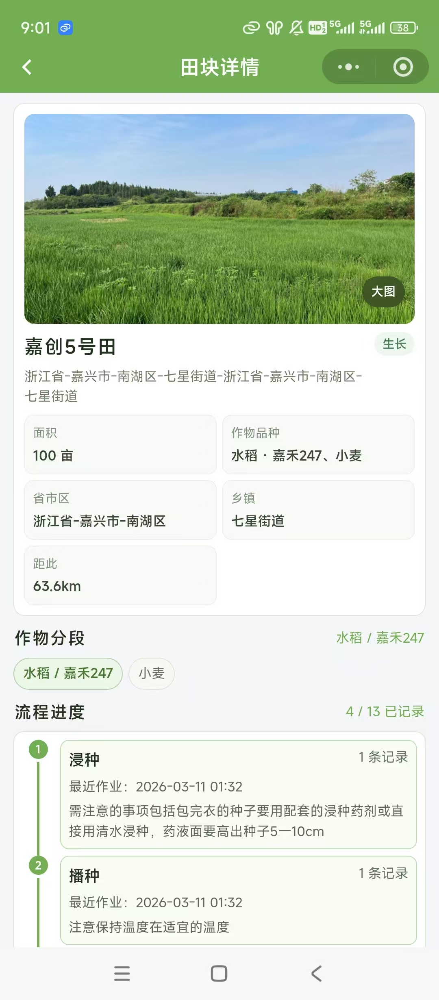
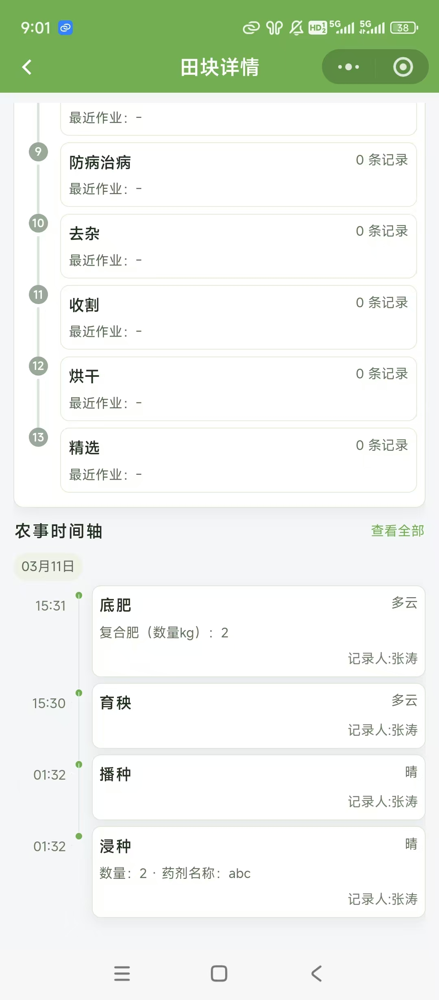
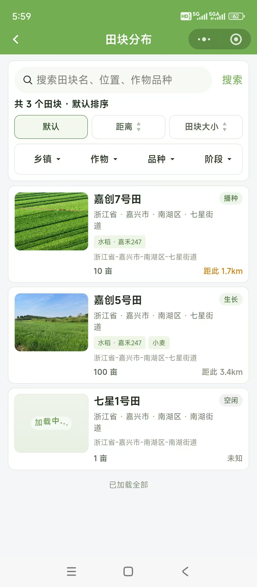
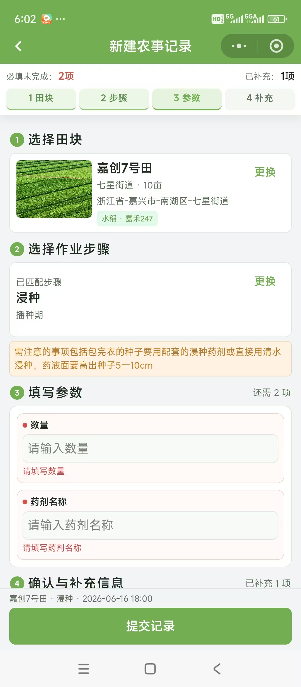
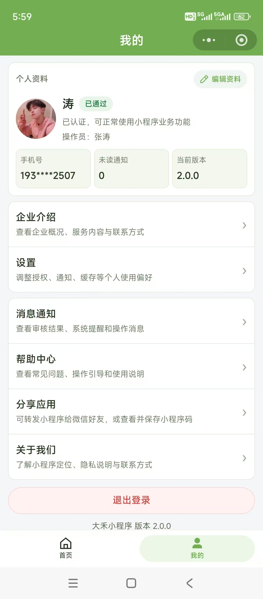
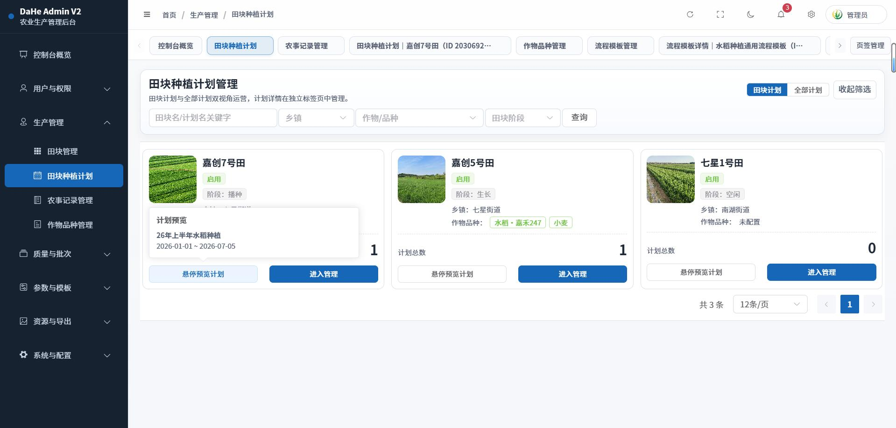
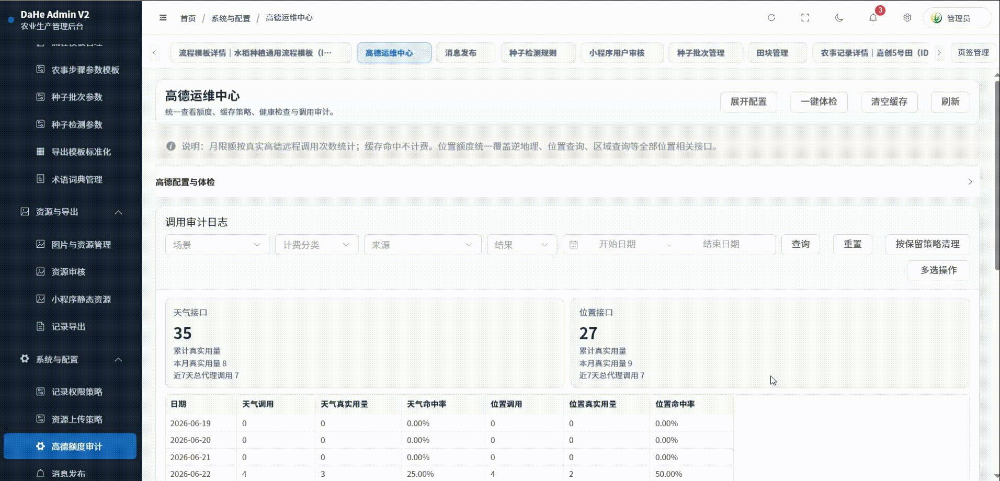

# DaHe V2

DaHe V2 是一套面向农业生产管理的全栈项目，包含后台管理端、小程序端和后端服务。项目围绕田块分布、农事管理、种子质量等业务场景，提供管理配置、移动端采集与后端接口支撑。

## 项目预览

<p>
  
</p>
<p>
  
</p>
<p>
  
</p>
<p>
  
</p>
<p>
  
</p>
<p>
  
</p>
<p>
  
</p>
<p>
  
</p>
<p>
  
</p>
<p>
  
</p>
<p>
  
</p>

## 项目结构

```text
DaHeAdminV2/   后台管理端，Vue 3 + Vite + Element Plus
DaHeAppV2/     小程序端，uni-app + TDesign
DaHeServeV2/   后端服务，Spring Boot + MyBatis-Plus + MySQL
```

## 核心模块

- 田块分布：田块基础信息、轮次管理、定位与地块业务配置。
- 农事管理：农事记录、流程模板、阶段与动态字段配置。
- 种子质量：批次管理、检测记录、芽率规则与动态参数配置。
- 系统管理：后台用户、角色权限、操作日志、静态资源与系统参数。

## 技术栈

- 前端后台：Vue 3、Vite、Element Plus、Vue Router、Axios。
- 小程序端：uni-app、TDesign uni-app。
- 后端服务：Spring Boot 2.7、Spring Security、MyBatis-Plus、MySQL、Redis、Knife4j。

## 本地运行

### 后端服务

```bash
cd DaHeServeV2
mvn spring-boot:run
```

后端配置通过环境变量覆盖，主要包含数据库、Redis、微信小程序与地图服务相关配置。默认接口前缀为 `/api/v2/**`。

### 后台管理端

```bash
cd DaHeAdminV2
npm install
npm run dev
```

### 小程序端

```bash
cd DaHeAppV2
npm install
```

安装依赖后，可使用 HBuilderX 或对应 uni-app 构建流程运行到微信小程序端。

## 文档

- `DaHeServeV2/README.md`：后端服务说明。
- `DaHeAdminV2/README.md`：后台管理端说明。
- `DaHeAppV2/README.md`：小程序端说明。
- `git.md`：本地提交与交付记录。
