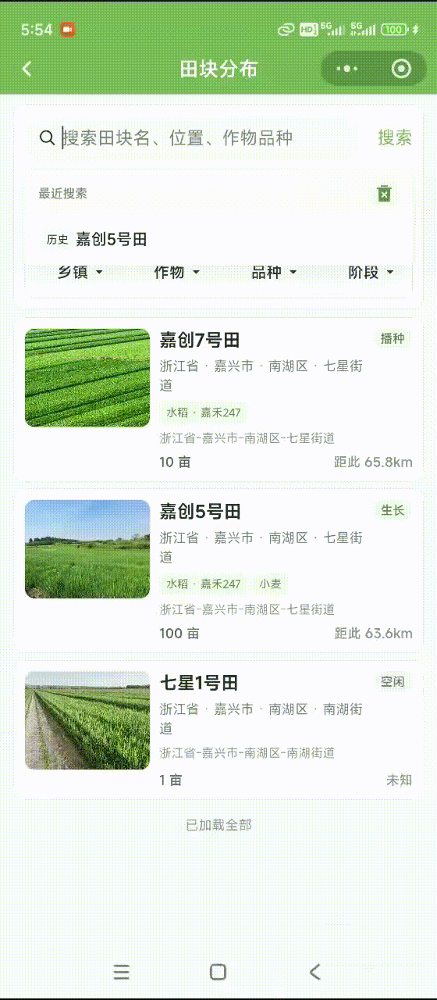
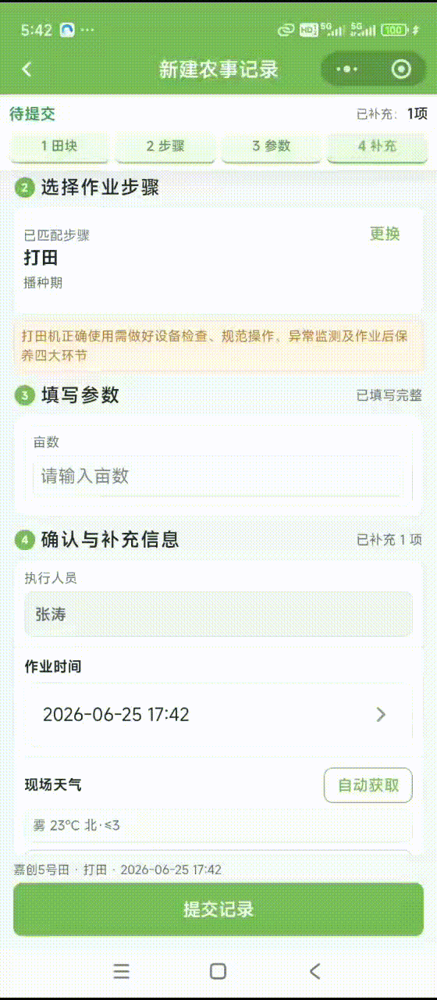
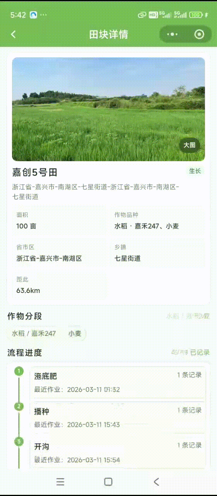
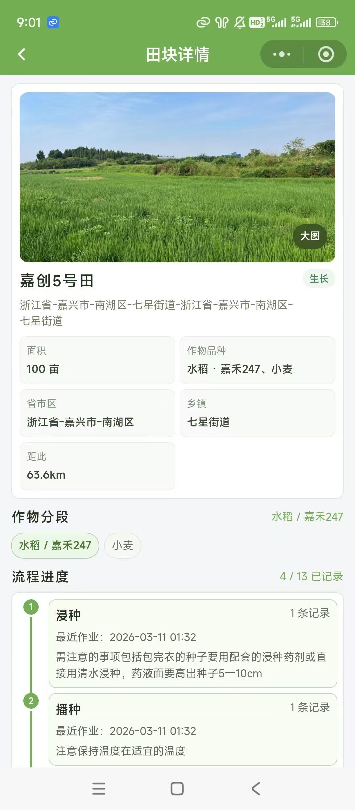
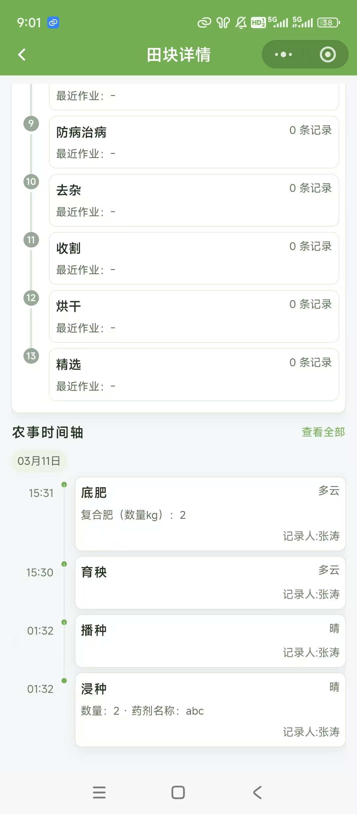
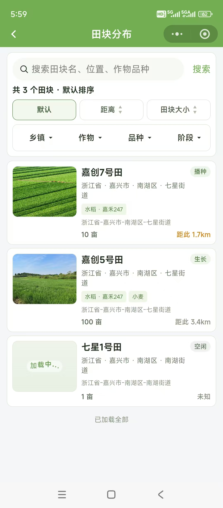
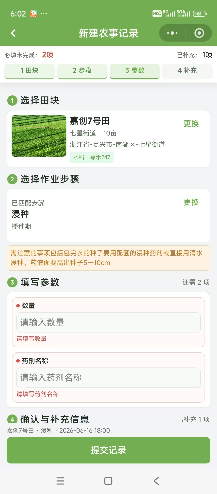
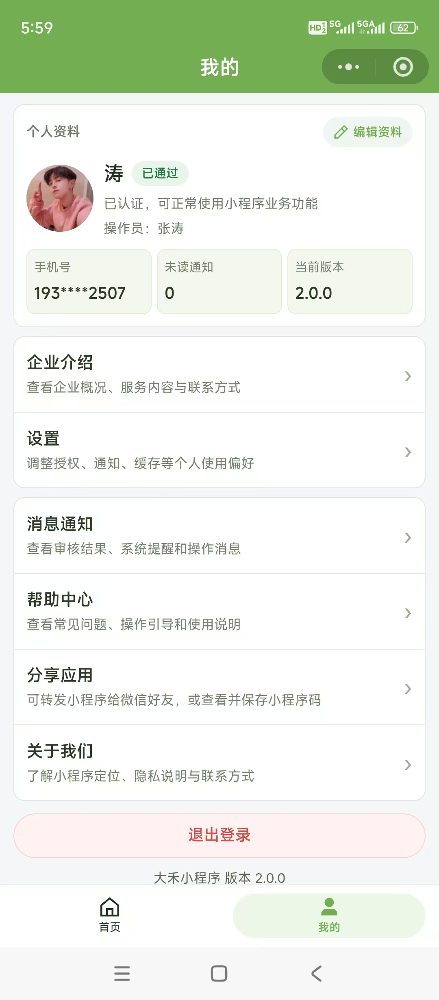
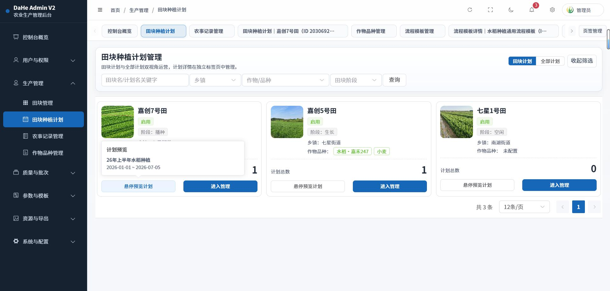
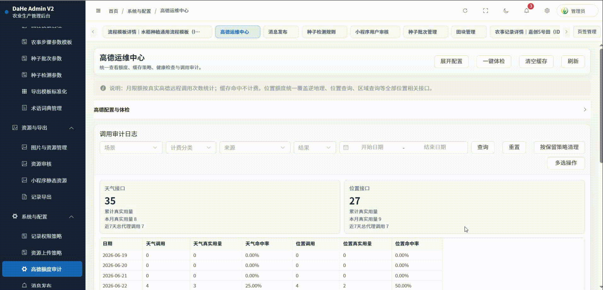

# 大禾农业 DaHe V2

面向农业生产管理的应用实践，覆盖田块分布、农事记录与种子质量管理，包含小程序、管理后台和后端服务的产品形态。

**Spring Boot · MyBatis-Plus · MySQL · Vue 3 · uni-app**

本公开仓库用于展示项目界面与业务流程，当前内容以截图、动图和说明为主，未包含完整应用源码。

## 业务场景

| 模块 | 主要功能 |
| --- | --- |
| 田块分布 | 田块信息、轮次管理、定位与业务配置 |
| 农事管理 | 农事记录、流程模板、阶段与动态字段 |
| 种子质量 | 批次、检测记录、芽率规则与动态参数 |
| 系统管理 | 用户、角色权限、操作日志与系统参数 |

## 产品预览

<table>
  <tr>
    <td></td>
    <td></td>
    <td></td>
  </tr>
</table>

<details>
<summary>展开更多界面和流程演示</summary>

<table>
  <tr>
    <td></td>
    <td></td>
    <td></td>
  </tr>
  <tr>
    <td></td>
    <td></td>
    <td></td>
  </tr>
  <tr>
    <td></td>
    <td></td>
    <td></td>
  </tr>
</table>

</details>

## 系统组成

以下为应用的组成说明，并非本公开仓库的源码目录。

| 应用 | 技术选型 | 职责 |
| --- | --- | --- |
| 管理后台 | Vue 3、Vite、Element Plus | 业务配置、数据管理与后台操作 |
| 微信小程序 | uni-app、TDesign | 移动端操作与数据采集 |
| 后端服务 | Spring Boot 2.7、Spring Security、MyBatis-Plus、MySQL、Redis | 业务接口、数据存储与权限处理 |

## 仓库内容

```text
img/          截图与操作动图
README.md     项目展示说明
LICENSE       仓库许可文件
```

本仓库不能直接执行应用构建或启动命令。浏览技术实现可参考同一主页的 [Tides 票务平台](https://github.com/19continue/tides) 和 [Tides AI 助手](https://github.com/19continue/tides-ai)。
